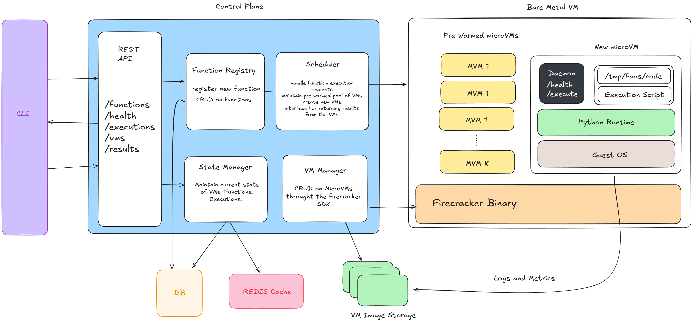

# Skyscale
An implementation of AWS Lambda-like Serverless Infrastructure

## Overview

Skyscale is a serverless platform that enables you to run functions in the cloud without managing infrastructure. The platform handles the provisioning, scaling, and management of the underlying compute resources, allowing you to focus solely on writing your code.

The core of Skyscale is the Lambda-style function - code that is executed in isolated micro-VMs powered by Firecracker, triggered by events or direct invocation.



## Current Features

- **Python Function Support**: Python-based Lambda-style functions with AWS Lambda-compatible interface
- **CLI & API Management**: Command-line interface and REST API for function management
- **Isolated Execution**: Each function runs in a secure, isolated Firecracker micro-VM
- **Go Agent**: A lightweight Go agent running inside each VM handling requests and interfacing with the Python runtime
- **Efficient VM Management**: Pre-warmed VM pool for reducing cold start times
- **Function Lifecycle Management**: Function creation, deployment, invocation, and monitoring
- **State Persistence**: SQLite database for storing function metadata and execution state

## Architecture

Skyscale consists of the following core components:

### Control Plane
- **Function Registry**: Manages function metadata, code, and configurations
- **VM Manager**: Handles the lifecycle of Firecracker micro-VMs
- **Scheduler**: Distributes incoming function invocations to appropriate VMs
- **State Manager**: Maintains the state of functions, executions, and VMs
- **API Server**: Exposes functionality through a REST API
- **Authentication Service**: Manages API keys and access control

### Execution Environment
- **Firecracker Micro-VMs**: Lightweight virtual machines for secure function isolation
- **Go Agent**: Handles communication between the VM and control plane, manages the runtime
- **Python Runtime**: Executes the function code within the VM
- **Network Stack**: Provides networking capabilities to functions

### CLI
- **Function Management**: Create, deploy, update, and delete functions
- **Invocation**: Directly invoke functions and retrieve results
- **Monitoring**: View logs and execution metrics

## Getting Started

### Prerequisites
- Linux operating system (required for Firecracker)
- Go 1.21 or later
- Python 3.8 or later
- Firecracker

### Installation

Clone the repository:
```bash
git clone https://github.com/bluequbit/faas.git
cd faas
```

Build the control plane:
```bash
cd control-plane
go build -o skyscale-control-plane
```

Build the CLI:
```bash
cd cmd/cli
go build -o skyscale
```

### Usage

Start the control plane:
```bash
./skyscale-control-plane
```

Create a new function:
```bash
./skyscale function create --name hello-world --runtime python3.8
```

Deploy the function:
```bash
./skyscale function deploy --name hello-world
```

Invoke the function:
```bash
./skyscale function invoke --name hello-world --payload '{"name": "John"}'
```

## Function Development

### Handler Format

All Python functions must follow this structure:

```python
def handler(event, context):
    # Your code here
    return response
```

Where:
- `event`: A dictionary containing the input data
- `context`: An object with runtime information about the execution
- `response`: The return value (can be a dict, list, string, or other JSON-serializable type)

### Example Function

```python
def handler(event, context):
    return {
        "message": f"Hello, {event.get('name', 'World')}!",
        "request_id": context.request_id
    }
```

Check the `examples/` directory for more sample functions and detailed documentation.

## Configuration

The control plane can be configured using environment variables:

- `PORT`: The port to listen on (default: 8080)
- `DB_PATH`: The path to the SQLite database (default: skyscale.db)
- `LOG_LEVEL`: The log level (default: info)
- `WARM_POOL_SIZE`: The size of the warm VM pool (default: 5)

## Development

### Project Structure
- `cmd/`: Command-line tools
- `control-plane/`: The control plane implementation
- `examples/`: Example functions and usage patterns
- `plugins/`: Extensions and plugins
- `tc-redirect-tap/`: Network utilities for Firecracker VMs
- `scripts/`: Utility scripts

### Running Tests
```bash
go test ./...
```

## License

This project is licensed under the MIT License - see the LICENSE file for details.

## Acknowledgements
- [Firecracker](https://github.com/firecracker-microvm/firecracker) - Secure and fast microVMs for serverless computing
- [Ignite](https://github.com/weaveworks/ignite) - Firecracker microVM manager